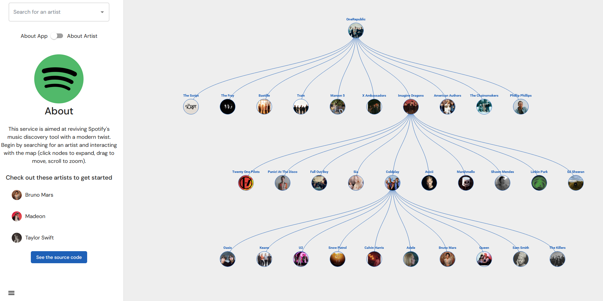

# MusicDiscovery
I've been learning Haskell and wanted to make something a little more complex this time around and getting an idea of how Haskell might look in a production-like environment (i.e. getting it deployed via EC2 + Docker). This service is aimed at reviving Spotify's music discovery tool with a modern twist -- allowing users to find new music in an interactive tree structure. For a deployed version, check out: https://musicdiscovery.kylecui.com/


## Backend
The backend is written in Haskell and uses Redis as a cache to store previous responses. The core modules are located in `music-discovery-backend/src`.
### Building and Running
To run the backend, some prerequisites are:
* You have access to the Spotify public APIs and have received a Spotify ClientID (see: https://developer.spotify.com/documentation/web-api/tutorials/getting-started)
	* The app pulls the values from environment variables (as defined in `Spotify.hs`)
* You have an instance of Redis running (see `Redis.hs` to change the default connection info)

To run the app (defaulting on port 8000 but can be changed in `Server.hs`), run:
```
stack run
```

### Dependencies
- aeson
- rio
- time
- lens-aeson
- servant-server
- wai
- warp
- wai-cors
- hedis
- read-env-var

## Frontend
The frontend is using JS + React, VisX for rendering the tree, and framer-motion for animations. The core pieces are locatedin `music-discovery-frontend/src`.

### Building and Running
To run the app (defaulting on port 3000):
```
npm install
react-scripts start
```
### Dependencies
- React
- Material UI
- VisX
- D3.js
- framer-motion

